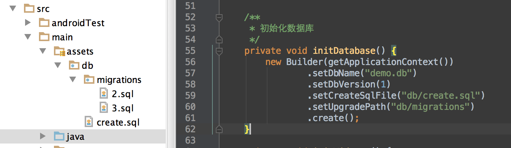

# Simpledb 开源框架

 

一个轻量级的 Android 异步数据库框架. 

* 异步操作
* 使用简单、方便
* 便于数据库升级
* 非ORM，关系映射自行处理
* 精简小巧, 只有 20 kb

> 适合的用户 ： 
> 
> * 不想使用太大的数据库开源库 ( 对apk大小有要求 )
> * 不想使用ORM 框架			

## 下载

[simpledb-1.0.aar 下载](output/simpledb-1.0.aar)

## 一、初始化数据库

```
import com.simple.database.Builder;

/**
* 初始化数据库
*/
private void initDatabase() {
    new Builder(getApplicationContext())
        .setDbName("demo.db")              // 数据库名为 demo.db
        .setDbVersion(1)                   // 数据库版本号为1
        .setCreateSqlFile("db/create.sql") // 创建数据库表的sql文件在 asserts/db/create.sql文件中
        .setUpgradePath("db/migrations")  // 数据库升级文件在 asserts/db/migrations 目录中
        .create();
 }
```

## 二、创建数据库表的sql语句

创建数据库的sql语句我们存放在 assets 目录中, 该文件可以在构建Builder时自行设置， 默认为 assets/db/create.sql文件。。



create.sql 为标准的sql语句, 示例如下: 

```
-- 用户表
CREATE TABLE users (
			 id TEXT unique ,
			 name TEXT not null,
			 gender INTEGER
) ;

-- 书籍表
CREATE TABLE books (
				id TEXT NOT NULL unique,
            	name TEXT NOT NULL
) ;

-- 借阅表
CREATE TABLE borrow (
				user_id TEXT NOT NULL,
            	book_id TEXT NOT NULL, 
            	UNIQUE(user_id, book_id)
 ) ;

```


## 三、数据库升级的sql语句

升级数据库的sql语句我们也是存放在 assets 目录中, 该目录我们也可以在构建Builder时自行设置，默认为 assets/db/migrations 文件夹。升级的sql文件命名模式为: 版本号.sql , 例如 3.sql 代表数据库从小于3的版本号升级到3时最后一次需要执行的升级语句。加入用户在数据库版本号为1时安装了应用，现在用户更新应用，此时该应用的数据库版本已经为3，并且版本2时也升级了数据库。那么 migrations中应该有两个文件，分别为 2.sql 和 3.sql， 此时该用户升级就会执行 2.sql 和 3.sql 中的语句.

例如, 2.sql 为 : 

```
ALTER TABLE users ADD COLUMN age INTEGER;
```

3.sql 为 : 

```
ALTER TABLE users ADD COLUMN gender INTEGER;
```

从版本号为1升级到3时，那么就会执行上述的sql语句。

**优点**: 


> ***注意*** : 如果升级了任意表结构，一定要到升级版本号,并且在 assets/db/migrations中添加对应的sql文件. 文件格式为:  版本号.sql 。
> 


## 数据库的增删改查


首先建立 操作数据库表的DAO对象, 例如 : 

```
/**
 * books 表的DAO对象。
 */
public class BookDao extends AbsDAO<Book> {

    public BookDao() {
        super("books");
    }

    @Override
    protected ContentValues convert(Book item) {
        ContentValues newValues = new ContentValues();
        newValues.put("id", item.id);
        newValues.put("name", item.name);
        return newValues;
    }

    @Override
    protected Book parseOneItem(Cursor cursor) {
        Book item = new Book();
        item.id = cursor.getString(0);
        item.name = cursor.getString(1) ;
        return item;
    }
}
```

增删改查接口，四个接口的参数都是 DAO的class, 例如 BookDao.class 。

* insertInto(Class daoClass) : 插入数据
* deleteFrom(Class daoClass) : 删除数据
* updateFrom(Class daoClass) : 更新数据
* selectFrom(Class daoClass) : 查询数据

上述四个接口都是 DatabaseHelper类中的静态共有函数，因此静态import之后就可以直接使用上述接口，使用示例如下: 

```
import static com.simple.database.DatabaseHelper.deleteFrom;
import static com.simple.database.DatabaseHelper.insertInto;
import static com.simple.database.DatabaseHelper.selectFrom;
import static com.simple.database.DatabaseHelper.updateFrom;


public class BookModel {

    public void insertBook(Book aBook) {
    	  // 插入图书
        insertInto(BookDao.class).withItem(aBook).execute();
    }

    public void deleteBook(Book aBook) {
        // 根据Id 删除图书
        deleteFrom(BookDao.class)
        	.where("id=?", new String[]{aBook.id}).execute();
    }

    public void updateBook(Book aBook) {
        // 更新数据
        updateFrom(BookDao.class).withItem(aBook)
              .where("id=?", new String[]{aBook.id}).execute();
    }

    public void queryAllBook(DbListener<List<Book>> listener) {
    	 // 查询所有图书
        selectFrom(BookDao.class).listener(listener).execute();
    }

    public void queryBook(String selection, String[] args, 
    						DbListener<List<Book>> listener) {
    	 // 按条件查询图书
        selectFrom(BookDao.class)
              .where(selection, args).listener(listener).execute();
    }
```